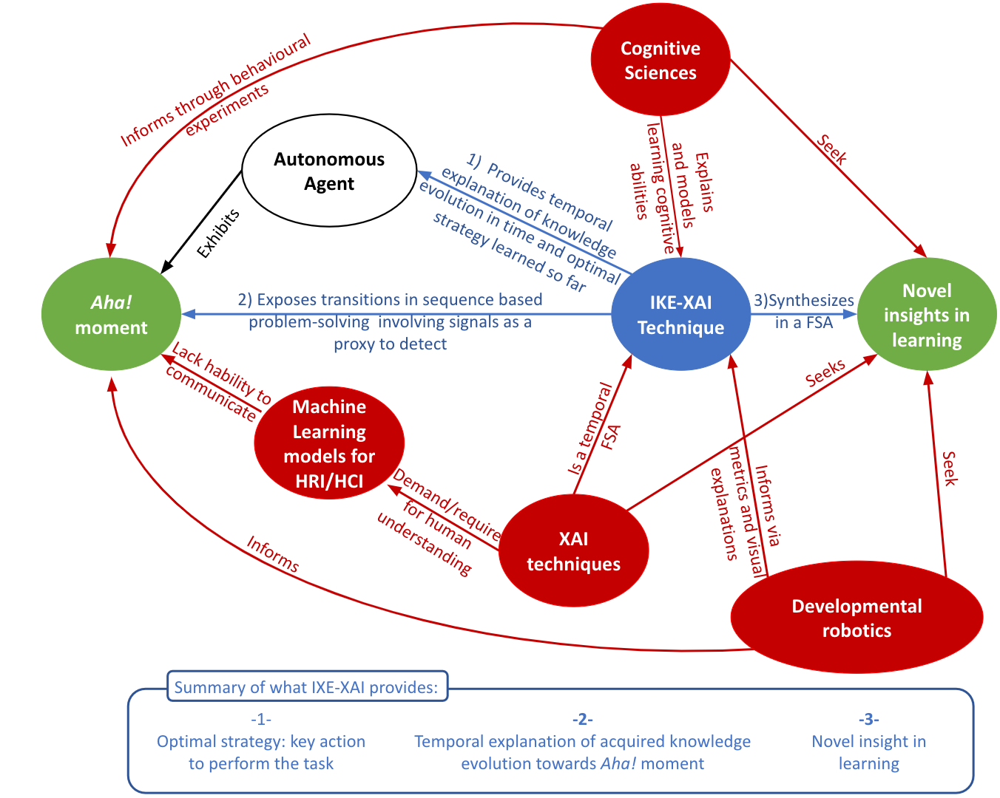

# Explaining Aha! moments in artificial agents through IKE-XAI: Implicit Knowledge Extraction for eXplainable AI #

last major update of readme: August 2022

### What is this repository for? ###

This repository presents the a jupyter notebook presenting the methodology Implicit Knowledge Extraction with eXplainable Artificial Intelligence, IKE-XAI, 
related to the article : 
CHRAIBI KAADOUD, Ikram , BENNETOT, Adrien, MAWHIN, Barbara, DIAZ-RODRIGUEZ, Natalia, Explaining <i>Aha!</i> moments in artificial agents through IKE-XAI: Implicit Knowledge Extraction for eXplainable AI. <i>Neural Networks</i>, 2022,https://doi.org/10.1016/j.neunet.2022.08.002

#### Abstract of the article: 
During the learning process, a child develops a mental representation of the task he or she is learning. A Machine Learning algorithm develops also a latent representation of the task it learns. We investigate the development of the knowledge construction of an artificial agent through the analysis of its behavior, i.e., its sequences of moves while learning to perform <b>the Tower of Hanoï (TOH)</b> task. The TOH is a wellknown task in experimental contexts to study the problem-solving processes and one of the fundamental processes of children’s knowledge construction about their world. 

We position ourselves in the field of <b>explainable reinforcement learning for developmental robotics, at the crossroads of cognitive modeling and explainable AI</b>. 
Our main contribution proposes a <b>3-step methodology named Implicit Knowledge Extraction with eXplainable Artificial Intelligence (IKE-XAI)</b> to extract the implicit knowledge, in form of an automaton, encoded by an artificial agent during its learning. We showcase this technique to solve and explain the TOH task when researchers have only access to moves that represent observational behavior as in human-machine interaction. Therefore, to extract the agent acquired knowledge at different stages of its training, our approach combines: 
** first, a Q-learning agent that learns to perform the TOH task; 
** second, a trained recurrent neural network that encodes an implicit representation of the TOH task; and
** third, an XAI process using a post-hoc implicit rule extraction algorithm to extract finite state automata. 

We propose using graph representations as visual and explicit explanations of the behavior of the Q-learning agent. Our experiments show that the IKE-XAI approach helps understanding the development of the Q-learning agent behavior by providing a global explanation of its knowledge evolution during learning. IKE-XAI also allows researchers to identify the agent’s Aha! moment by determining from what moment the knowledge representation stabilizes and the agent no longer learns.

#### Keywords: 
Explainable AI, Reinforcement Learning, Cognitive modeling, Developmental robotics, Knowledge extraction, Implicit learning, Post-hoc rule extraction, The Tower of Hanoï, Q-learning, Long Short Term Memory

 Figure 1 of Chraibi Kaadoud et al (2022)- Conceptual summary of current works and related fields: Knowledge graph of all contributed elements (in green) to explain sequential problem-solving and domain disciplines (in red) that inform IKE-XAI method. (Figure extracted from the original article)

### How and what environment to install? ###

* Summary of set up
    The main file is a jupyter notebook that can be used locally (pay attention to the parameters) and as a Google colab file: https://colab.research.google.com/?hl=fr

* Dependencies
    pip3 install tensorflow==2.0 : if not, tensorflow.callback.Callbacks does not work
    The reader can refer to the top of the jupyter notebook for dependencies

### Structure of the repository ###
* Python files:
    ** Extracting_Aha_moment_from_Qlearning_agent_through_IKE-XAI_method.ipynb: jupyter notebook with the three steps of IKE-XAI methodology
    ** tohgrammar.py: Python class defining the TOH grammar that allows to generate training sequences for the RNN model with LSTM
    ** rnnlstmmodel.py: Python class defining the RNN model with LSTM
    ** datasetofsequences.py: Python class dedicated to sequence management (e.g., transformation to interface with Keras)
    ** tools.py: Python file with "tool" functions
    
* JSON files:
    ** rnn_lstm_model_parameters.json: JSON file with the parameters of the RNN model with LSTM
    ** xai_hanoi.json: JSON file with the parameters of the XAI steps
    
* Outputs:
    ** the code will create a "Results" directory for all the similations according the number of N disks choosen for the TOH task

### Contact ? ###

For any question, please contact: ikram.chraibi-kaadoud@imt-atlantique.fr

**Credit authorship contribution statement:  
***Ikram Chraibi Kaadoud:*** Implementation of all project parts (Reinforcement Learning, Recurrent neural network with LSTM, XAI)  
***Adrien Bennetot:*** Implementation of the Reinforcement Learning part  

### How to cite this repository ? ### 

@misc{chraibiKaadoud2022XAI_RL_Github,
  author = {Chraibi Kaadoud I, Bennetot A, Mawhin B, Charisi V, Díaz-Rodríguez N.},
  title = {Extracting Aha moment from Qlearning agent through IKE-XAI method},
  year = {2022},
  publisher = {GitHub},
  journal = {GitHub repository},
  howpublished = {\url{https://github.com/ichraibi/Extracting_Aha_moment_from_Qlearning_agent_through_IKE-XAI_method.ip}}
}

OR 

Ikram Chraibi Kaadoud, Adrien Bennetot, Barbara Mawhin, Vicky Charisi, Natalia Díaz-Rodríguez, Extracting Aha moment from Qlearning agent through IKE-XAI method, <i>GitHub repository</i>, 2022.
